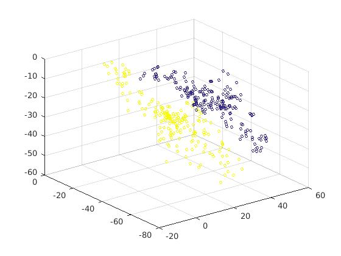
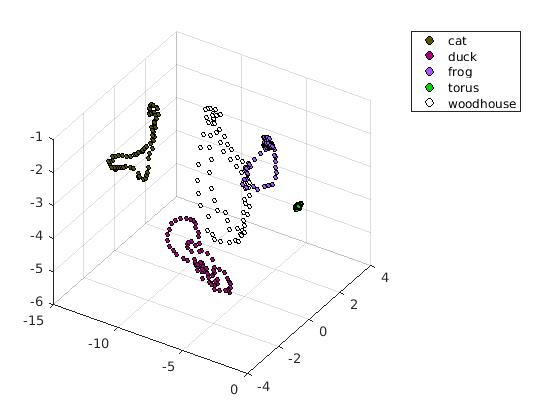

# neighbourhood_component_analysis
MATLAB code for Neighbourhood Component Analysis, based on Jacob Goldberger, Sam Roweis, Geoff Hinton, Ruslan Salakhutdinov's paper.

The blue dots are the projections (Y = AX) of faces, while yellow dots are nonfaces. So this can be used for clustering.

COIL100 example. Non linear conjugate gradient update.